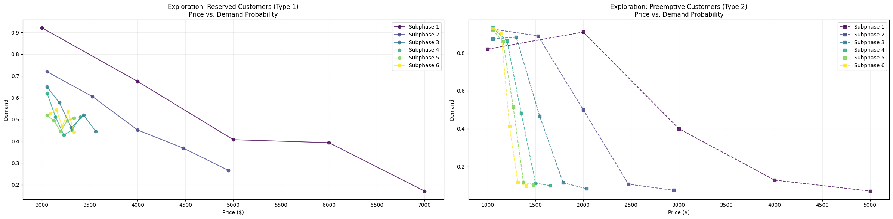
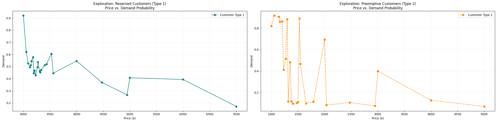

# Primal-Dual Learning for Inventory-Constrained Dynamic Pricing

## Project Overview

This project implements a Primal-Dual Learning Algorithm for personalized dynamic pricing under inventory constraints. The goal is to optimize pricing decisions when customer demand curves are unknown and inventory is limited.

The project is motivated by a telecommunications use case where excess GPU capacity in Radio Access Network infrastructure can be monetized through dynamic pricing. The algorithm learns demand behavior during an exploration phase and then applies inventory-aware pricing decisions during an exploitation phase.

## Problem Statement

A provider has limited GPU inventory and needs to sell compute instances to different customer types. Demand is uncertain and price-sensitive, so the system must learn demand curves while maximizing revenue and avoiding inventory overuse.

The main challenge is balancing:

- Revenue maximization
- Inventory constraints
- Unknown customer demand
- Different customer types
- Exploration versus exploitation

## Methodology

The implementation follows a two-phase Primal-Dual Learning framework.

### Phase 1: Exploration

- Tests different prices for each customer type
- Observes customer demand at different price points
- Estimates demand probabilities
- Calculates the dual variable, representing the shadow price of inventory
- Identifies optimal prices and refines price intervals

### Phase 2: Exploitation

- Uses learned demand estimates to project future demand
- Compares expected demand with remaining inventory
- Adjusts prices based on inventory sufficiency
- Calculates revenue and regret against an oracle benchmark

## Key Features

- Simulated demand generation using logistic demand curves
- Customer-type-specific demand behavior
- Dual variable estimation using numerical optimization
- Demand estimation using Random Forest classification
- Inventory-aware dynamic pricing
- Revenue and regret calculation
- Visualization of price-demand and price-revenue relationships

## Technologies Used

- Python
- Jupyter Notebook
- NumPy
- pandas
- SciPy
- scikit-learn
- Matplotlib
- Random Forest Classifier
- Numerical Optimization

## Repository Structure

```text
primal-dual-dynamic-pricing/
│
├── README.md
├── requirements.txt
├── .gitignore
│
├── notebooks/
│   └── primal_dual_algo.ipynb
│
├── reports/
│   └── project_report.pdf
│
├── images/
│
└── src/
    └── README.md

## Visual Results

### Exploration Phase: Price vs Demand

Customer Type 1:



Customer Type 2:



### Final Revenue Analysis

Customer Type 1:


Customer Type 2:


