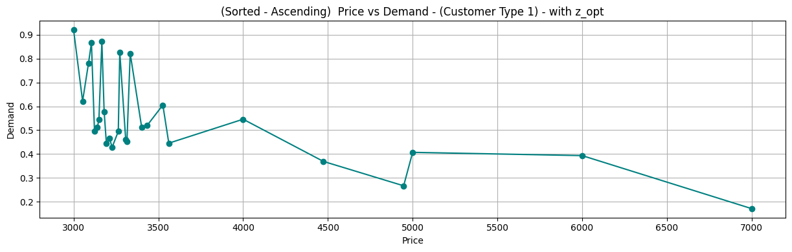
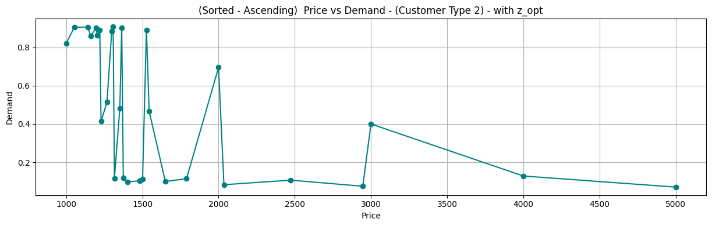
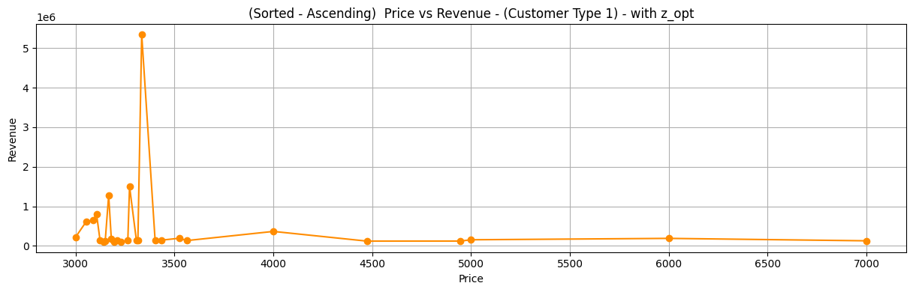
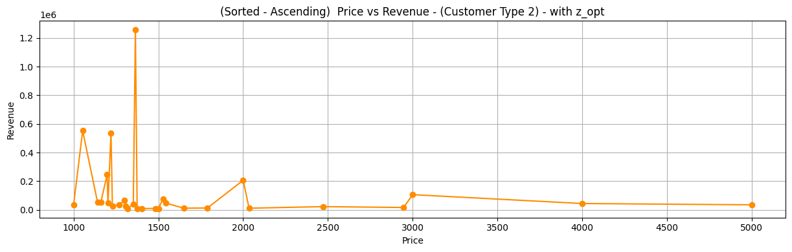
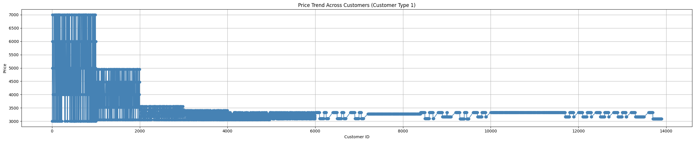
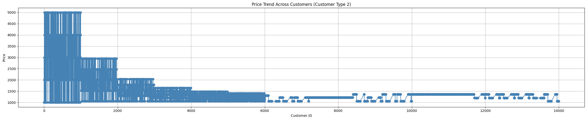

# Primal-Dual Learning for Inventory-Constrained Dynamic Pricing

## Project Overview

This project implements a **Primal-Dual Learning Algorithm for personalized dynamic pricing under inventory constraints**. The objective is to optimize pricing decisions when customer demand curves are unknown and inventory is limited.

The project is motivated by a telecommunications use case where excess GPU capacity in Radio Access Network infrastructure can be monetized through dynamic pricing. The algorithm learns demand behavior during an exploration phase and then applies inventory-aware pricing decisions during an exploitation phase.

The implementation is developed in Python using a Jupyter Notebook and evaluates the algorithm using simulated customer demand, dual variable estimation, Random Forest-based demand prediction, revenue calculation, and regret analysis.

---

## Problem Statement

A provider has limited GPU inventory and needs to sell compute instances to different customer types. Demand is uncertain and price-sensitive, so the system must learn customer demand curves while maximizing revenue and avoiding inventory overuse.

The main challenge is balancing:

- Revenue maximization
- Limited inventory capacity
- Unknown customer demand
- Different customer types
- Exploration versus exploitation
- Inventory-aware price adjustment

---

## Business Context

In a telecommunications environment, Radio Access Network infrastructure may contain GPU resources used for internal AI-enhanced network operations. During off-peak periods, part of this compute capacity may be available for external customers.

The provider must decide:

- What price to offer
- Which customer type to target
- How much inventory to allocate
- When to increase or decrease prices
- How to avoid selling too much limited capacity too early

This makes the problem suitable for a dynamic pricing and revenue management approach.

---

## Methodology

The project follows a two-phase **Primal-Dual Learning framework**.

### Phase 1: Exploration

The exploration phase focuses on learning customer demand behavior and estimating the value of inventory.

Main steps:

- Test different prices for each customer type
- Observe customer buying behavior
- Estimate demand probabilities
- Calculate the dual variable, representing the shadow price of inventory
- Identify optimal prices for each customer type
- Refine price intervals around the best-performing prices

### Phase 2: Exploitation

The exploitation phase uses the learned demand estimates to make pricing decisions while considering remaining inventory.

Main steps:

- Use learned prices from the exploration phase
- Estimate future demand at the selected price
- Compare projected demand with remaining inventory
- Continue with the optimal price if inventory is sufficient
- Adjust prices upward or downward if inventory is constrained
- Calculate revenue, oracle revenue, and regret

---

## Algorithm Components

### 1. Demand Generation

Customer demand is simulated using logistic demand curves. The demand probability decreases as price increases, representing realistic price-sensitive customer behavior.

Two customer types are modeled:

- **Customer Type 1:** Reserved customers
- **Customer Type 2:** Preemptive customers

Each customer type has different price sensitivity and willingness-to-pay behavior.

### 2. Dual Variable Estimation

The dual variable represents the marginal value of one additional unit of inventory. It helps the algorithm make pricing decisions that consider both immediate revenue and inventory scarcity.

A higher dual variable indicates that inventory is becoming scarce, so the algorithm becomes more conservative in pricing and allocation decisions.

### 3. Demand Estimation using Random Forest

A Random Forest classifier is used to estimate buying probability based on observed price-demand data.

The model helps estimate:

- Probability of purchase at a given price
- Future demand during exploitation
- Inventory pressure under different pricing decisions

### 4. Revenue and Regret Analysis

The algorithm calculates:

- Actual revenue generated by the pricing policy
- Oracle benchmark revenue
- Regret, which measures the gap between the algorithm and the ideal oracle solution

Lower regret indicates better algorithm performance.

---

## Key Features

- Simulated customer demand using logistic demand curves
- Multi-customer-type dynamic pricing
- Primal-dual learning framework
- Dual variable estimation using numerical optimization
- Random Forest-based demand estimation
- Exploration and exploitation phase implementation
- Inventory-aware price adjustment
- Revenue calculation
- Oracle benchmark comparison
- Regret analysis
- Visual analysis of price-demand and price-revenue relationships

---

## Technologies Used

- Python
- Jupyter Notebook
- NumPy
- pandas
- SciPy
- scikit-learn
- Matplotlib
- Random Forest Classifier
- Numerical Optimization

---

## Repository Structure

```text
primal-dual-dynamic-pricing/
│
├── README.md
├── requirements.txt
├── .gitignore
├── LICENSE
│
├── notebooks/
│   ├── README.md
│   └── primal_dual_algo.ipynb
│
├── reports/
│   ├── README.md
│   └── project_report.pdf
│
├── images/
│   ├── README.md
│   ├── exploration_price_demand_customer_type_1.png
│   ├── exploration_price_demand_customer_type_2.png
│   ├── sorted_price_demand_customer_type_1_with_z_opt.png
│   ├── sorted_price_demand_customer_type_2_with_z_opt.png
│   ├── sorted_price_revenue_customer_type_1_with_z_opt.png
│   ├── sorted_price_revenue_customer_type_2_with_z_opt.png
│   ├── price_trend_customer_type_1.png
│   └── price_trend_customer_type_2.png
│
└── src/
    └── README.md
```

---

## Visual Results

### Exploration Phase: Price vs Demand

The exploration phase tests different prices and observes demand behavior for each customer type.

#### Customer Type 1: Reserved Customers


#### Customer Type 2: Preemptive Customers


---

### Final Demand Analysis with Dual Variable

These plots show the final relationship between price and demand after applying the primal-dual learning logic with the estimated dual variable.

#### Customer Type 1



#### Customer Type 2



---

### Final Revenue Analysis with Dual Variable

The final revenue plots show how revenue changes across price points after applying the primal-dual learning approach.

#### Customer Type 1



#### Customer Type 2



---

### Price Trend Across Customers

These plots show how pricing decisions evolve across customer arrivals.

#### Customer Type 1



#### Customer Type 2



---

## Results Summary

The implemented algorithm was evaluated using simulated multi-type customer demand. The results show that the primal-dual learning approach can adapt prices based on demand behavior and inventory constraints.

Key observations:

- Demand generally decreases as price increases.
- Different customer types show different price sensitivity.
- The exploration phase helps identify useful price regions.
- The dual variable helps account for inventory scarcity.
- Revenue varies significantly across price points.
- The algorithm supports inventory-aware pricing decisions under uncertain demand.

---

## How to Run the Project

### 1. Clone the Repository

```bash
git clone https://github.com/praveenrajece2018-code/primal-dual-dynamic-pricing.git
```

### 2. Navigate to the Project Folder

```bash
cd primal-dual-dynamic-pricing
```

### 3. Install Required Packages

```bash
pip install -r requirements.txt
```

### 4. Open Jupyter Notebook

```bash
jupyter notebook
```

### 5. Run the Notebook

Open and run:

```text
notebooks/primal_dual_algo.ipynb
```

---

## Requirements

The project requires the following Python libraries:

```text
numpy
pandas
matplotlib
scikit-learn
scipy
jupyter
```

These dependencies are listed in the `requirements.txt` file.

---

## Project Report

The full academic project report is available in the `reports/` folder:

```text
reports/project_report.pdf
```

The report includes:

- Introduction and industry context
- Problem formulation
- Literature review
- Primal and dual optimization methodology
- Algorithm explanation
- Implementation details
- Demand generation
- Demand estimation
- Results and analysis
- References

---

## Learning Outcomes

Through this project, I strengthened my understanding of:

- Dynamic pricing
- Revenue management
- Inventory-constrained optimization
- Primal-dual algorithms
- Demand curve learning
- Exploration-exploitation trade-off
- Dual variable interpretation
- Machine learning-based demand estimation
- Random Forest classification
- Simulation-based evaluation
- Regret analysis
- Data visualization for algorithm performance

---

## Future Improvements

Possible future improvements include:

- Modularizing the notebook into separate Python scripts
- Adding real-world demand data
- Extending the model to more customer types
- Improving demand estimation with additional machine learning models
- Adding automated experiment tracking
- Creating a dashboard for pricing and revenue analysis
- Comparing the primal-dual approach with other pricing algorithms
- Adding unit tests for key algorithm functions

---

## Authors

This project was completed as part of the **M.Sc. Data Analytics and Decision Science** program at **RWTH Aachen University**.

Project contributors:

- Praveen Balakrishnan
- Gurusaran Sivakumar
- Shivam Patil
- Vijayan Shinde

---

## Acknowledgement

This project was carried out in an academic setting with guidance from RWTH Aachen University and industry collaboration with Vodafone Group Plc.

---

## License

This repository is shared under an Academic and Portfolio Use License. See the `LICENSE` file for details.
